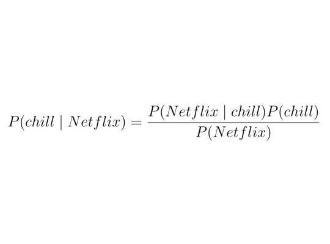

# [Three Little Words](https://en.wikipedia.org/wiki/Greek_words_for_love)

## ~~Storge~~

// The kind of love we show nonverbally

// storge.c
```
    #include "stdio.h"
    int main() {
        char storge[] = {
            0x69, 0x20,
            0x6C, 0x6F, 0x76, 0x65, 0x20,
            0x79, 0x6F, 0x75, 0x0
        };
        printf("%s\n", storge);
    }
```

I don't always say those three little words.

Sometimes I say "go die". Sometimes I say "wow I'm dumb". Sometimes I say "I'm sorry I made you angry". Sometimes I say "I'm so glad to see you, it's been far too long and I really missed your smile."

Sometimes when I'm with you I choke up like I'm on stage for the first time and blush like I can't remember the words in my script so I choose instead to shout silence. I promise myself at this very moment to express my "I love you" with a token, an offering. I picture a pink rose, a warm drink, or a small chocolate. In my minds eye, I scout for nearest locations where I can acquire these tributes. A heartbeat passes. My blushing dissipate like the mist off of the bay, and my voice returns because I know my actions speak louder than words.

`gcc storge.c`

`./a.out`

# ~~Eros~~

// The kind of love we feel with our bodies

[1 4 3.](http://images.furycomics.com/viewer/e0/e0c9e5ecc4f810585746fe376a9127a3/25.jpg)

> What's in a name? That which we call a rose by any other name would smell as sweet. So Romeo would were he not Romeo called.

A name is just a pointer\*. It's a reference to an unseen thing. The name of a thing summonrs it. When we use a thing's name, we conjure within ourselves its memory. In this way, a name is a summary of an entity.

How then do we summarize other things?

0. [abstract things](http://mathworld.wolfram.com/TaylorSeries.html)
1. [intangibles](https://www.cliffsnotes.com/)
2. [digitals](https://en.wikipedia.org/wiki/Gzip)
3. [memories](https://s-i.huffpost.com/gen/1119986/images/o-HOW-PHOTOGRAPHS-BOOST-HAPPINESS-facebook.jpg)
4. [humans](http://obituaries.triblive.com/obituaries/triblive/)

What about words? Can we summarize words?

- `Encode each string by the length of the word.`

- `This encoding reduces each word to a single byte.`

- `If the word is common enough, you can decipher the meaning from the encoding.`

Fuck you.

4 3.

Bitch. 

5.

I love you.

1 4 3.

Sometimes I miss you. Sometimes I think about your sensual touch. Sometimes I miss our passion, and I lust after you.

[4 3.](http://images.furycomics.com/viewer/e0/e0c9e5ecc4f810585746fe376a9127a3/12.jpg)

I don't miss the romance. I don't miss the emotional support. What do I miss?

[It Rhymes With Rust.](http://images.furycomics.com/viewer/e0/e0c9e5ecc4f810585746fe376a9127a3/13.jpg)

# ~~Philia~~

// The kind of love we show with our words

`..  .-.. --- ...- .  -.-- --- ..-`

I miss you like the Sea misses the Sky. I miss you like the Sun yearns to kiss the Earth, like icarus misses his wings.

I used to love to watch your chest rise and lower as you slept. Now I love to watch your scales catch the light as you uncoil.

My heart is fissile, and you sundered and rent. Your quotidian chiding I took for coquettishness, your temerity I took for allure. Now, with your smaragdine talons fastened tight against my cardiac interstice, I realize you have occluded the ice-water in my veins, and, with Cimmerian recalcitrance and remorselessness, you have arrested the trickle of my lifeblood. This is how I go, with your name on my lips, my blood under your nails, and your lipstick around my waist.

# ~~Agape~~

// The kind of love we feel with our hearts

```
               |  \ \ | |/ /
               |  |\ `' ' /
               |  ;'aorta \      / , pulmonary
               | ;    _,   |    / / ,  arteries
      superior | |   (  `-.;_,-' '-' ,
     vena cava | `,   `-._       _,-'_
               |,-`.    `.)    ,<_,-'_, pulmonary
              ,'    `.   /   ,'  `;-' _,  veins
             ;        `./   /`,    \-'
             | right   /   |  ;\   |\
             | atrium ;_,._|_,  `, ' \
             |        \    \ `       `,
             `      __ `    \   left  ;,
              \   ,'  `      \,  ventricle
               \_(            ;,      ;;
               |  \           `;,     ;;
      inferior |  |`.          `;;,   ;'
     vena cava |  |  `-.        ;;;;,;'
               |  |    |`-.._  ,;;;;;'
               |  |    |   | ``';;;'  FL
```

Bae's Theorem


The thing about _Netflix and Chill_ is that it means a lot of things to a lot of different people. For some, it is an obvious allusion to swapping fluids. To me, it's much more innocent. _Netflix and Chill_ is reserved for rainy days, for low-energy companionship, for snuggling, for feeling your heartbeat, for my chilly hands on your soft stomach.

It's none of the excitement, all of the simplicity. It's sharing favorite TV shows and making a habit of working through it, one episode at a time. Daily love is the purest kind. Because no matter how sour the relationship gets, we will always have fond memories of _Netflix and Chill_, ice cream and the summer heat. Snowball fights and woolen hats. Flat tires and Happy Meals.

And, the clearest memory of them all, I'll always remember those three little words.

```
            `"9Q@"'        .gQQQQQQg, .jQQQQQQQg.     `"MQQ"`  `"MP"`
              .QF         jQQQQQQQQQQ_gQQQQQQQQQg       .Q#      .f
              .QF         jQQQQQQQQQQQQQQQQQQQQQQ.      .Q#      .f
              .QF         `QQQQQQQQQQQQQQQQQQQQQP       .Q#      .f
              .QF          `QQQQQQQQQQQQQQQQQQQF`       .Q#      .f
              .QF           `9QQQQQQQQQQQQQQQM'         .Q#      .f
              .QF             "QQQQQQQQQQQQQ@`          .Q#      .f
              .QF              "MQQQQQQQQQQf            .Q#      .f
              .QF                "QQQQQQQW'             .Q#      .f
              .QF                 `QQQQQP`              `QQ.    .j'
            ._jQg_,                `MQM'                 "9QgyygM'
            ```````                  ^`                     ```
```
